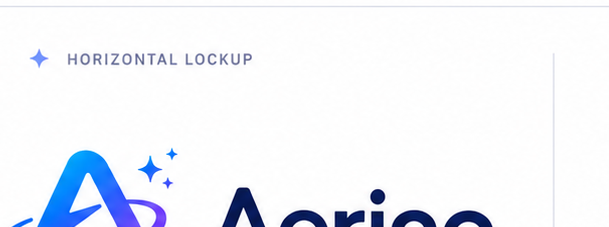
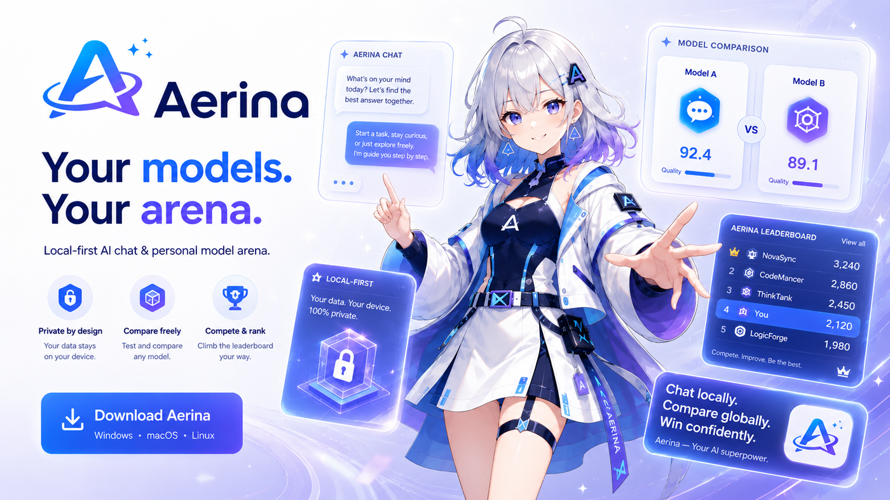
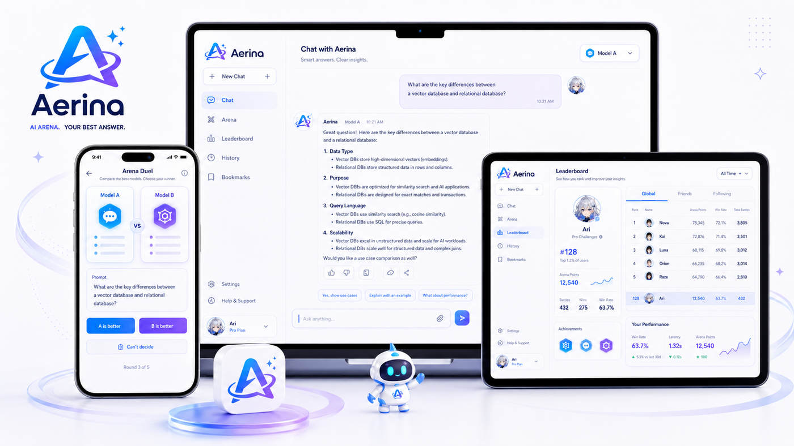
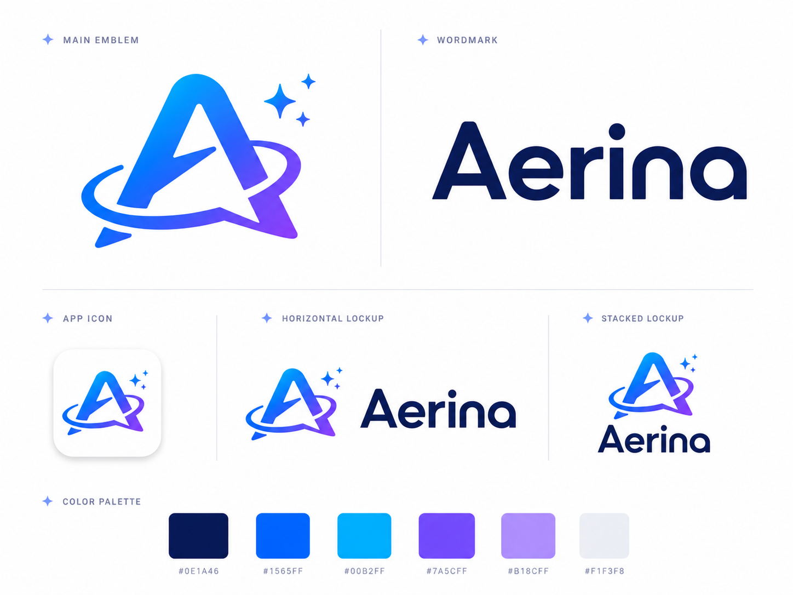

# Aerina

<p align="center">
  
</p>

<p align="center">
  <strong>Local-first AI chat &amp; personal model arena.</strong><br/>
  <em>Your models. Your arena. · Different Minds. Better Answers.</em>
</p>

<p align="center">
  
</p>

## What it is

Aerina is a local-first, cross-platform multi-model AI client:

- Single-model chat with streaming Markdown / thinking blocks
- Side-by-side multi-model comparison (pick best → ranking)
- Personal leaderboard & usage stats
- Conversation tree, fork, multi-user profiles
- Provider → model presets (OpenAI Chat / Responses / Anthropic Messages)
- Remote MCP servers
- Optional future: cloud sync, agent runtime / agent arena

Privacy by design: data stays on your device. Cloud sync and API key upload are optional and off by default.

## Screenshots

| Product | Brand |
| --- | --- |
|  |  |

More assets: [`docs/brand/`](docs/brand/)

## Brand

| Asset | Path |
| --- | --- |
| App icon | `docs/brand/app-icon-1024.png` · `apps/client/src-tauri/icons/` |
| Logo mark | `docs/brand/logo-mark.png` · `apps/client/public/brand/logo-mark.png` |
| Horizontal logo | `docs/brand/logo-horizontal.png` |
| Wordmark | `docs/brand/wordmark.png` |
| Hero / mockups | `docs/brand/hero-banner*.png`, `product-mockup*.png` |

Palette: `#0E1A46` · `#1565FF` · `#00B2FF` · `#7A5CFF` · `#B18CFF` · `#F1F3F8`

## Docs

- [Project Plan v1.1](docs/project-plan-v1.1.md)
- [Architecture Summary](docs/architecture-summary.md)

## Core principles

- SQLite is the source of truth
- No login required
- Cloud sync and API key sync are optional and off by default
- Chat / multi-model compare share one conversation tree
- Ranking and stats are derived from events
- Domain logic lives in Rust; UI is display-only

## Status

Implemented (desktop client, no sync server yet):

- Cargo monorepo (`apps/`, `crates/`, `migrations/`)
- Domain tree: Conversation / Branch / Round / Candidate / ContentBlock (incl. Thinking)
- SQLite + multi-profile local data isolation
- OpenAI Chat, OpenAI Responses, Anthropic Messages providers
- Stream generation + Tauri event bridge
- Vue 3 + Vuetify MD3 client: Chat, Stats/Ranking, Providers, MCP, Appearance
- Secrets store, analytics events, Elo leaderboard

## Develop

```bash
npm install
cargo test
npm run dev
# or full desktop shell:
npm run tauri -- dev -- --config apps/client/src-tauri/tauri.conf.json
```

From `apps/client`:

```bash
npm run tauri dev
```

Configure a provider under **Settings → Providers**, fetch models from the API, add presets, then chat.

## License

See repository license file if present; project is under active development.
